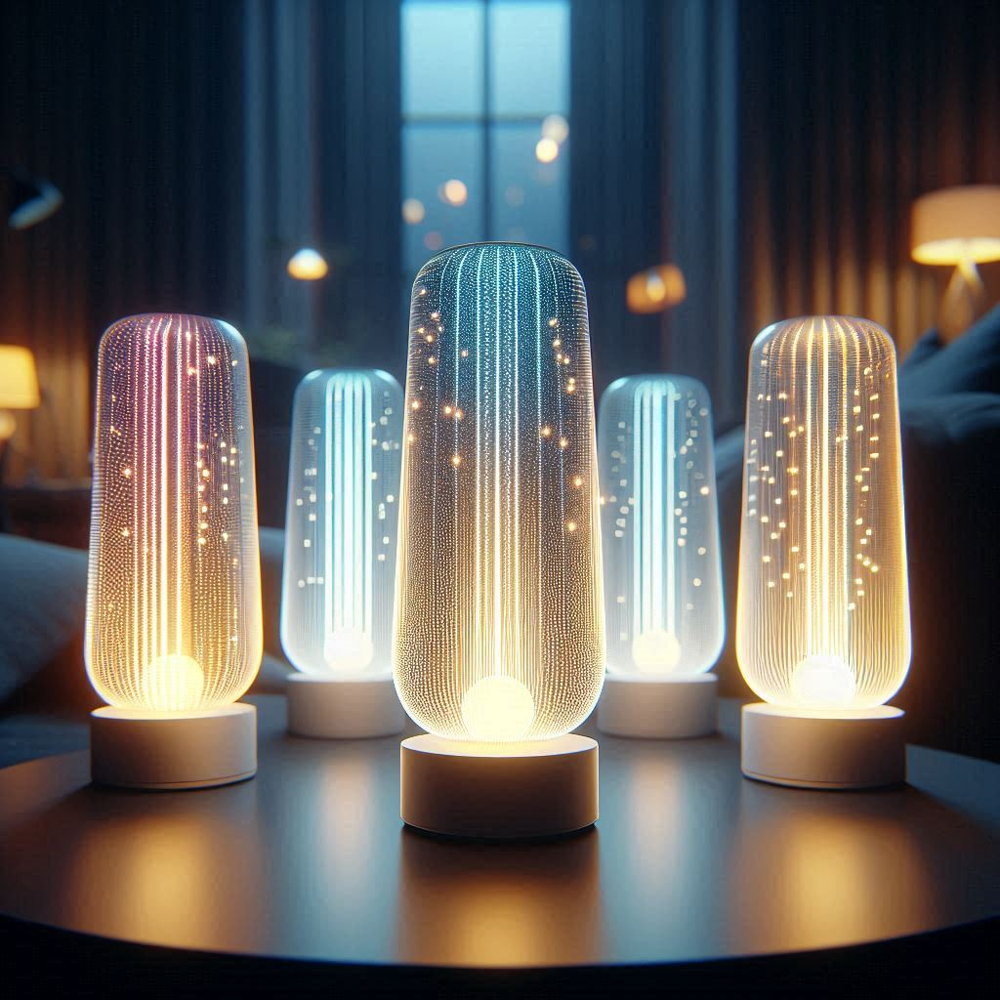
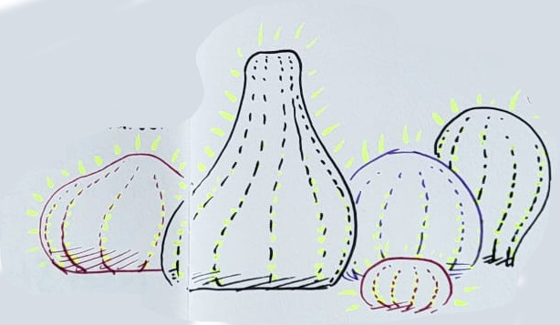
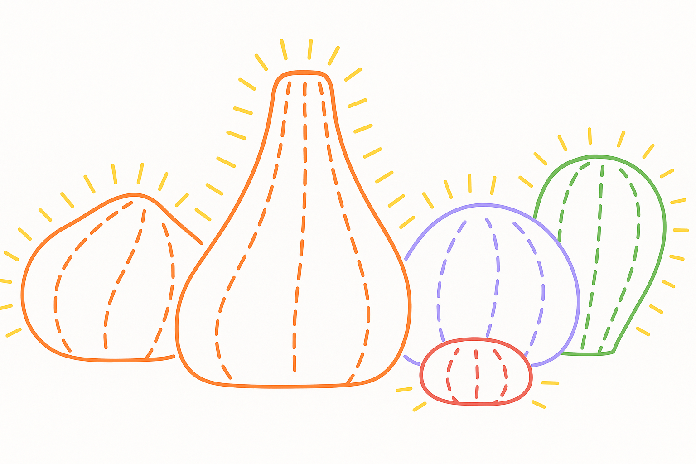

# JellyBerry May brief for Beth

**3 days' work, following our Friday 23rd call**

- Version: 1
- Created: 27th May 2025 by Rich Plastow

---

## Longer Term Goals

- Create a clear, concise, and compelling description of the JellyBerry concept
  that can be shared with the Loop.Coop community and potential funders.
- Make the JellyBerry concept more tangible, so that it starts to feel more real
  and gets people excited!
- Create a project page on Loop.Coop to showcase the JellyBerry concept and
  invite community involvement.
- Improve our genAI skills by using AI to create images and videos, and also
  help speed up writing.
- Begin working towards a distinctive brand (look and feel, tone of voice) for
  JellyBerry, which will eventually be used for https://jellyberry.io and
  packaging, etc

## Tasks for May 2025

### 1. Consolidate Ian and Rich's work and ideas into a single document

I think the concept has been pretty solid since 17th April, when Ian and I
had a call. I made some notes from that meeting, which I've written up in this
markdown file:

[20250417-a-very-brighton-soft-hardware-platform.md](./20250417-a-very-brighton-soft-hardware-platform.md)

There's also the Trello Board. I'll make sure that its up to date with some of
the recent images and videos of Ian's LED prototypes:

<https://trello.com/b/fWmwLE8f/jellyberry>

### 2. Use AI to generate images and video-clips, visualising the concept

**To some extent, you are designing the look of JellyBerry here. Its form, but
also the way the lights and colours work, and the way the devices interact with
each other. So this is a really important task, and I think it will be fun too!**

#### Image generation, just from text prompts

I've found that ChatGPT/Sora creates very high quality images from prompts, but
they're safe, boring, and don't follow the prompt very well. So ChatGPT/Sora is
great for adding final detail and polish [to an existing image.](#image-generation-from-existing-images-with-prompts-to-add-or-change-things).

I've found that Bing Image Creator (DALL-E) creates more interesting images, and
it follows the prompts better, but the resolution is lower. So Bing is great for
creating imaginative initial images from prompts.

Visit https://www.bing.com/images/create and sign in with a Microsoft account.

Prompt:

> A very high quality 3D render of 5 glowing lamps. They each have a different inner-glow colour, and they also have vertical lines of tiny lights on their surfaces. They are on a table in a dimly lit living room. Close up, with living room very out-of-focus behind them.

Result:

#### Image generation from existing images, with prompts to add or change things

Start:

Uploaded to https://sora.chatgpt.com (I just have the free version of this -
seems fine)

Prompt:

> A technical drawing. Looks like it was created using a vector drawing app like Adobe Illustrator. No labels or text. Keep the same coloured lines. Preserve the shapes, sizes and positions of the 5 objects. Preserve the way that the dotted/dashed lines on the surface of the objects run in vertical lines. MUST colored lines on a white background, with no black anywhere. NO patches of solid black or color anywhere. EVERYTHING in the drawing MUST be colored lines on a plain flat white background. Also, extend the short yellow glow-lines around the right of the rightmost object.

The best result of 4:

Clicked 'Remix' on the image, and added this prompt:

> A very high quality 3D render of 5 glowing lamps. They each have a different inner-glow colour, and they also have vertical lines of tiny lights on their surfaces. They are on a table in a dimly lit living room. Close up, with living room very out-of-focus behind them.

The best result of 4:

#### Video generation from an image, with prompts to describe what happens

There's better video generation tools out there (fairly expensive), and also
some free ones (a pain to use, and poor quality). Adobe Firefly will let you get
started for £10, so let's try that.

Visit https://firefly.adobe.com/generate/video

You'll get one video generation for free, but after that you need to pay £10 for
a month of credits (Adobe Firefly Standard).

Upload 20250417-main-image-3d-render.png as the start frame.

You could also upload a 'final frame' image, which could be a photoshopped version of the original image, or maybe one of the other generated options images.

> The camera slowly dolly-zooms in. The 5 lamps change color, graduating from top to bottom. Each of the 5 lamps is able to sense the colours of nearby lamps, and slowly harmonises with them, so that color changes slowly spread along the group. The lamps all start reds and orange, but then the big middle one turns purple (graduating top to bottom) which makes the other lamps slowly change too. All the time, the tiny surface lights are twinkling and shimmering in many different harmonising colors.

The result zooms in too much:

I rewrote the prompt...

> The 5 lamps are all changing color, all graduating from top to bottom all of the time. Each of the 5 lamps is able to sense the colours of nearby lamps, and slowly harmonises with them, so that color-changes slowly spread around the lamps. The lamps all begin red and orange, and stay red and orange for 1 second. Then the big middle one turns purple (graduating top to bottom) over the course of 1 second. Then the other lamps slowly react, and change to purple too (also graduating top to bottom). All the time, the tiny surface lights on the lamps are twinkling and shimmering in many different harmonising colors. The camera does not move.

...but then found out that only 1 video generation is free :-D

### 3. Start one of the videos

It would be great to have the rough beginnings of one video ready by the start
of June.

## Tasks for June 2025

### 4. Finish 2 videos (~5 minutes each)

One will be a broad vision, introducing people to the concept

The other could be a 'making of' video, showing how the concept has developed,
and how the prototypes have been made. 

### 5. Create 2 image galleries

These will become carousels on the project page.

Probably one gallery related to to each video.

### 6. Write the text for the project page

Here's a suggestion for the sections:

- Introduction / Overview
- Benefits
- How it works
- Roadmap: where we are now, next steps, and longer term vision
- Team
- Get involved

### 7. Create https://loop.coop/projects/jellyberry/

This will be the first 'Proposed Project' page on the relaunched Loop.Coop
website 🎉 🚀
